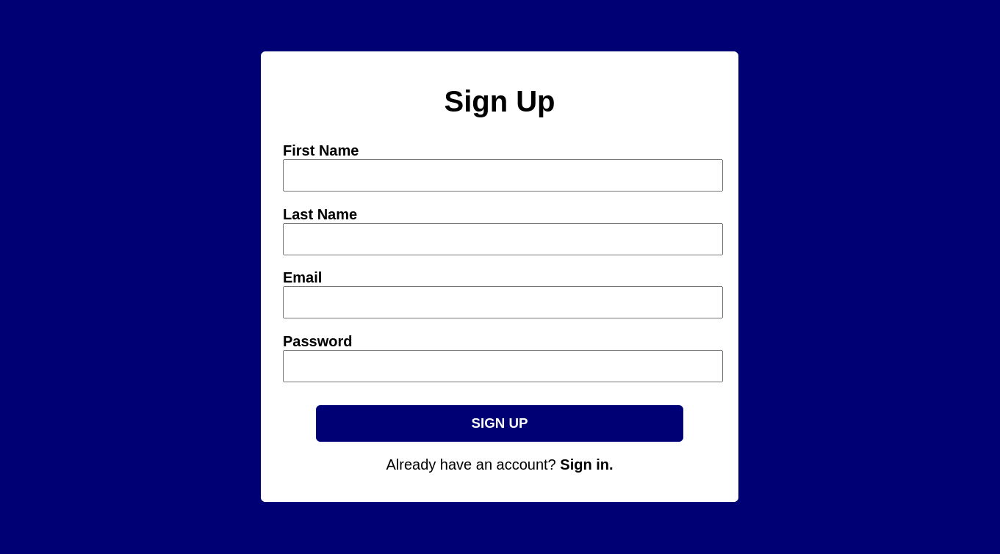
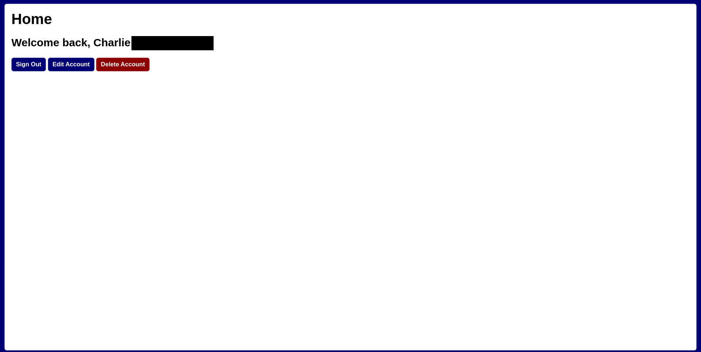
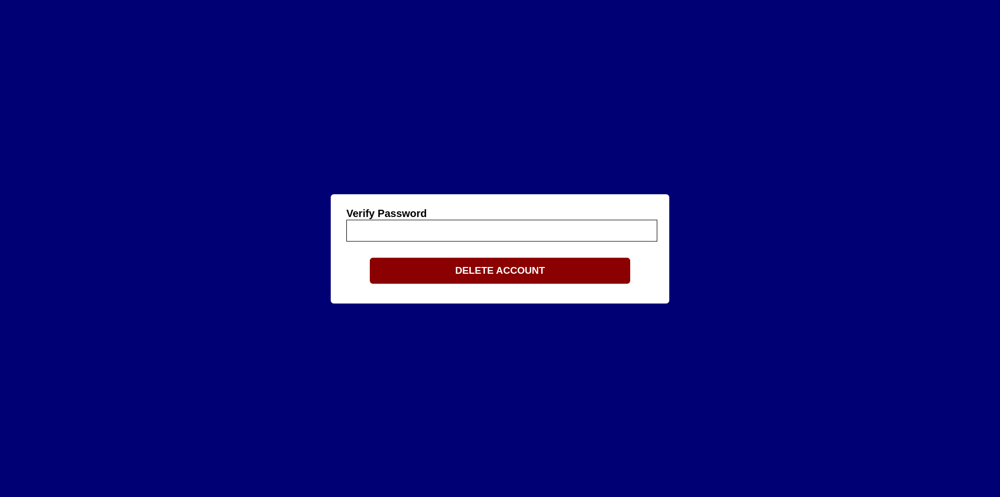

# Node.js Login Chat App

<strong>THIS IS A WORK IN PROGRESS, FEATURES MAY BE MISSING.</strong>

## What is this project?

A chatroom website written in Node.js using Socket.IO for communication between clients. Express.js and the Node.js implementation of SQLite are used for a login system allowing users to register, login, edit, and delete an account at any time. Passwords are hashed using bcrypt so they are stored securely in the database. 

## Features

🟢 = Fully working | 🟡 = Partly working/in progress | 🟠 = To be added | 🔴 = Broken

* Database 🟢
* Sign Up 🟢
* Sign In 🟢
* Session management system 🟢
* Homepage 🟢
* Edit account 🟢
* Delete account 🟢
* Remember me 🟢
* Two-step verification 🟠
* Mobile support 🟢
* List of connected users 🟢
* Message displayed on joining/leaving chat 🟢
* Sending and receiving messages 🟢
* Previous chat history displayed on joining 🟢
* 250 character limit on messages 🟢
* Administrator accounts with ban and delete powers 🟠
* Different chatrooms 🟠
* Changing username updates it in chat logs 🟠
* Deleting account updates it to "DELETED" in chat logs 🟠
* Session renewal on a regular basis 🟠

## Installation instructions

### Dependencies

* Node.js v17 or newer
* NPM package manager
* Git

### Terminal/command prompt

```
git clone https://github.com/chasc0des/nodejs-login-chat-app.git
cd nodejs-login-chat-app
npm install .
npm start
```

By default, the program can be accessed on ``http://localhost:8080`` or from another machine on your network, ``http://<YOUR IP ADDRESS>:8080``.

## Screenshots










